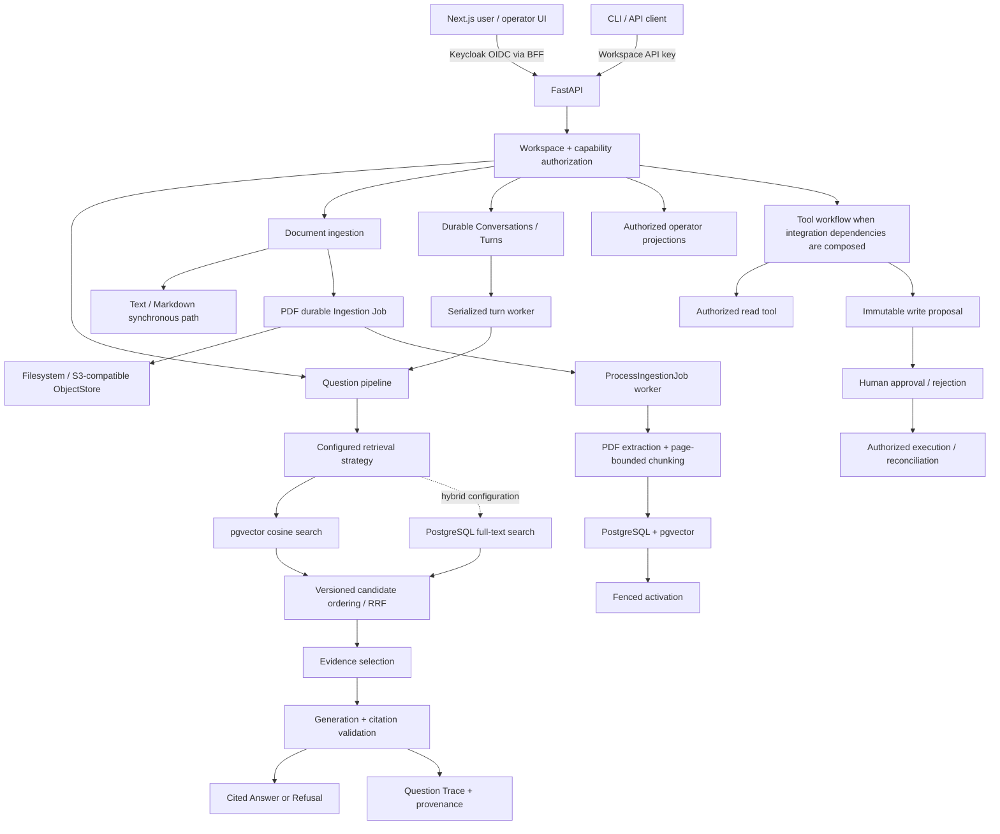

# Knora Agent

**Knora is a workspace-scoped AI knowledge and support system that ingests documents, retrieves grounded evidence, and returns answers with traceable citations.**

It is built around backend and applied-AI engineering concerns that are easy to hide in a simple chatbot demo: durable ingestion, versioned retrieval, evidence provenance, workspace isolation, reproducible evaluation, and human-authorized external actions.

> **Current state:** the cited-RAG, production-shaped ingestion, hybrid retrieval/evaluation, human-approved tool slices, durable Conversation backend, and Ollama-backed PDF re-index path are implemented on `main`. The product UI/auth refinement and model-backed answer-quality acceptance are still in progress. No hosted production deployment is claimed.

## Why Knora

Document Q&A becomes difficult to trust when the system cannot explain where an answer came from or what happened before it produced that answer.

Knora treats those concerns as system design problems:

- answers are grounded in a request-scoped Evidence Set and expose source citations;
- insufficient evidence produces a refusal instead of an invented citation;
- PDF ingestion is durable asynchronous work rather than a long-running upload request;
- retrieval behavior is tied to immutable/versioned configurations and embedding spaces;
- authorization is scoped to a Workspace before protected resources are used;
- evaluation records the dataset, corpus, configuration and scorer provenance behind a result;
- write-capable tools require explicit human approval and fresh execution authority.

The project is intentionally closer to a small AI-backed service than to a prompt wrapper.

## What is implemented

### Cited knowledge retrieval

Knora can ingest text, Markdown and PDF sources, retrieve supporting chunks and return either a cited answer or an explicit refusal. Citation projections preserve enough document/version/source-location information for a reviewer to trace the answer back to its evidence.

### Production-shaped PDF ingestion

PDF upload creates durable work. Source objects, ingestion jobs, processing attempts, retry state and serving pointers are persisted independently of the HTTP request.

Worker coordination uses leases and fencing so an expired worker cannot publish a stale result. Reprocessing is modeled as a new processing generation instead of mutating historical attempts.

### Versioned vector and hybrid retrieval

The answering layer exposes one retrieval seam while the PostgreSQL adapter supports configured retrieval strategies.

Current implementation includes:

- pgvector cosine retrieval;
- PostgreSQL full-text retrieval;
- exact Embedding Configuration matching;
- deterministic candidate ordering;
- versioned Reciprocal Rank Fusion for hybrid retrieval;
- evidence selection with chunk-count, overlap and token-budget constraints;
- persisted retrieval/candidate provenance for analysis.

Vector-only configurations remain useful reproducible baselines; hybrid retrieval does not silently replace them.

### Workspace-scoped authorization

Documents, ingestion jobs, retrieval, question traces, operator observations and tool data are scoped to a Workspace.

The backend supports workspace-scoped API credentials and Keycloak bearer authentication. Bearer principals additionally carry explicit capabilities, while FastAPI remains the authority for workspace and capability checks.

### Human-approved tools

Milestone 4 adds an explicit boundary between knowledge retrieval and external actions.

Knora includes a read-only ticket lookup capability and a write workflow built around:

`proposal → human approval/rejection → authorized execution → reconciliation`

Approval is not treated as execution authority. Before a side effect, the backend revalidates the current Workspace, capability, external-scope binding and policy compatibility. Durable execution identity, fencing, provider-side idempotency and audit records protect retry/recovery paths.

The workflow and HTTP contracts are implemented; concrete external support-system gateways and authority bindings are supplied by an integration/deployment composition rather than silently enabled by the default local app.

### Durable Conversations

Knora persists independent Conversations and Turns in PostgreSQL. Turn admission is idempotent and serialized per Conversation, worker claims are fenced, and reconnect/recovery reads persisted status instead of assuming an uncertain execution succeeded.

Follow-up context is bounded and conversation-local. Previous turns help resolve references, but facts still require fresh authorized retrieval and the existing evidence/citation/refusal gates remain authoritative.

### User and operator surfaces

The repository also contains a Next.js application with:

- document list/detail and upload flows;
- archive/unarchive controls;
- document embedding-readiness and re-index status;
- question answering over synchronous REST or staged SSE progress;
- distinct final-answer, refusal, failure and interruption states;
- citation inspection from server-projected evidence;
- read-only M4 lifecycle presentation;
- operator views for traces, evaluation observations and operational state;
- a Keycloak OIDC BFF/session boundary that keeps bearer credentials out of browser JavaScript.

The workspace-centric Conversation UI/auth refinement tracked under Product #109 is still being integrated; backend Conversation contracts are already durable.

## Architecture



The backend owns document, retrieval, evidence, trace, evaluation and tool state. The frontend consumes public contracts; it does not independently decide whether evidence is sufficient, reconstruct citations heuristically, or grant itself approval/execution authority.

## Engineering highlights

### Durable ingestion instead of request-bound processing

Text and Markdown can use the synchronous ingestion path, but PDF processing is modeled as durable work.

A PDF submission persists the source object and a Workspace-scoped Ingestion Job before background derivation. Attempts have explicit state, retry policy, lease ownership and fencing generations. Source/version identity is separated from parser, chunking and embedding derivations, and activation occurs only when the target is still valid.

The local Windows demo now includes a real ingestion worker entrypoint. Production scheduling remains a deployment concern rather than an HTTP progress loop.

See [Milestone 2 — Production-shaped ingestion](docs/specs/done/milestone-2-production-ingestion.md).

### Retrieval is configuration, not hidden application state

Embedding and Retrieval Configurations are explicit identities.

Retrieval operates only on active Embedding Sets that match the selected embedding configuration. Hybrid retrieval combines eligible vector and lexical candidates inside the PostgreSQL adapter, deduplicates them by canonical chunk identity and applies a versioned fusion policy.

The local Ollama path resolves `qwen3-embedding:0.6b` into an immutable digest-bound 1024-dimensional profile. Existing documents keep their historical vector space until they are explicitly re-indexed under the deployed profile; incompatible active corpora fail closed instead of being compared across spaces.

See the [Architecture Standard](docs/standards/architecture.md), [Production Retrieval V2 design](docs/design/m3-retrieval-rrf-v2-authority-proposal-r9.md), and [local Ollama runbook](docs/runbooks/local-ollama.md).

### Evidence stays separate from generation

Providers do not get to invent database citation identities.

Knora creates request-scoped evidence aliases, supplies selected evidence to generation, validates the structured generation result, and projects citations from server-owned evidence metadata. An empty or insufficient Evidence Set leads to refusal rather than fabricated support.

This makes structural citation correctness independently testable from semantic answer quality.

### Authorization is checked at the domain boundary

A Workspace is the primary isolation boundary.

Protected paths establish a `WorkspacePrincipal`, verify that the request belongs to the authorized Workspace and, for bearer sessions, require the relevant capability before protected operations proceed. Operator access, document access and tool authority remain separate capabilities.

The Next.js BFF handles browser session transport, but FastAPI remains the final authorization authority.

### Tool approval is a real safety boundary

A model-generated proposal cannot approve itself and a human approval does not automatically grant write authority.

Proposal intent is immutable. Approval binds the reviewed action and its versioned capability/scope/policy context. Execution rechecks current authority immediately before the external side effect, while logical idempotency and execution fencing protect retries, crashes and reconciliation.

See [Milestone 4 design](docs/design/milestone-4-tools-human-approval.md) and [ADR 0015](docs/adr/0015-human-approved-tool-execution-boundary.md).

### Evaluation is part of the architecture

Knora keeps evaluation inputs and measurements versioned rather than treating one manual answer as proof of RAG quality.

The repository contains:

- a 20-case Milestone 1 dataset for deterministic structural/retrieval evaluation and model-backed semantic baselines;
- a separate 50-case Milestone 3 corpus-grounded dataset contract;
- dataset and corpus manifests with checksums/provenance;
- HTTP-based evaluation through the normal question endpoint;
- retrieval metrics such as Recall@k and reciprocal rank;
- model-backed semantic scoring with explicit scorer version and measurement method;
- latency, token, cost and provider-error observations kept separate from quality measurements;
- append-safe reports and repeatability checks.

Historical evaluation results are scoped observations under their recorded dataset/configuration. They are not presented here as evidence of general benchmark superiority.

See [Evaluation](docs/evaluation.md).

## Request flows

### Document ingestion

```text
Upload
  → workspace authorization
  → durable source / Document Version identity
  → synchronous text path
       or
    durable PDF Ingestion Job
  → worker claim + fenced attempt
  → extraction / normalization / chunking
  → embeddings
  → immutable Chunk Set + Embedding Set
  → fenced activation
```

### Question answering

```text
Question / Conversation Turn
  → workspace + conversation authorization
  → bounded prior-turn context when applicable
  → configured retrieval
  → vector and optionally full-text candidates
  → deterministic ordering / fusion
  → evidence selection
  → generation
  → citation / output validation
  → Question Trace
  → persisted Cited Answer or Refusal
```

## Tech stack

| Layer | Current implementation |
| --- | --- |
| API / application | Python 3.12–3.14, FastAPI, Pydantic |
| Persistence | PostgreSQL, SQLAlchemy, Alembic |
| Vector retrieval | pgvector, cosine similarity; mixed profile dimensions with DB/profile guards |
| Lexical / hybrid retrieval | PostgreSQL full-text search, versioned RRF |
| PDF ingestion | `pypdf`, durable PostgreSQL jobs, fenced worker attempts, hard child-process memory limits |
| Object storage | Local filesystem or S3-compatible storage; MinIO in Docker Compose |
| AI providers | Deterministic local adapters; Ollama Qwen3 embeddings; OpenAI-compatible embedding/generation; native Gemini embedding adapter |
| Frontend | Next.js 15, React 18, TypeScript |
| Browser authentication | Keycloak OIDC through a Next.js BFF; FastAPI bearer validation |
| Testing | pytest, Ruff, Vitest, Testing Library, OpenAPI drift checks |
| Evaluation | Versioned JSONL datasets/manifests, HTTP runners, deterministic and model-backed scoring |
| Verified local runtime | Windows host for Ollama/API/PDF worker/frontend; Docker Desktop for PostgreSQL/pgvector and MinIO |

## Daily local development

After the one-time `.env` setup, use the dedicated development supervisor for normal coding:

```powershell
.\scripts\start-dev.ps1
```

It uses the same Windows-host + Docker storage topology, but creates a separate `knora_dev` database and optimizes the edit-run loop:

- FastAPI runs with Uvicorn auto-reload for `backend/src/knora`;
- the ingestion worker watches Python source and restarts only at a safe job boundary;
- if a worker is busy, it finishes the admitted job, stops claiming new work, then restarts;
- Next.js keeps its normal Fast Refresh / HMR behavior;
- PostgreSQL, MinIO and Ollama do not restart for ordinary source edits;
- unexpected worker crashes are surfaced instead of hidden behind an infinite restart loop.

`Ctrl+C` stops the API, worker and frontend supervisor children; PostgreSQL and MinIO remain running for a faster next start. Root `.env` is loaded at launcher startup, so restart `start-dev.ps1` after changing `.env`.

Use `start-ollama-demo.ps1` instead when you need the stable #103 demo/acceptance runtime without source watchers. See [Local development on Windows](docs/runbooks/local-development.md) for the exact reload and shutdown behavior.

## Stable local demo — Ollama PDF re-index

The verified local real-embedding path is Windows-oriented. It runs Ollama, FastAPI, the PDF ingestion worker and Next.js on the Windows host, while PostgreSQL/pgvector and MinIO stay in Docker Desktop.

This path proves real 1024-dimensional Ollama embedding and retained-PDF re-indexing. It does **not** by itself claim model-backed answer quality; that semantic acceptance remains a separate gate.

### Prerequisites

- Windows with PowerShell
- Python 3.12–3.14
- Node.js/npm compatible with `frontend/package-lock.json`
- Docker Desktop running Linux containers
- Ollama for Windows
- `qwen3-embedding:0.6b` pulled locally
- an existing Keycloak configuration if authenticated browser sign-in is required

### 1. Install backend and frontend dependencies

```powershell
git clone https://github.com/NhiBuaa/knora-agent.git
Set-Location knora-agent

python -m venv .venv
.\.venv\Scripts\python -m pip install -e ".\backend[dev]"
npm --prefix frontend ci
```

If Ollama is not already running, start it in a separate PowerShell session. Pull the embedding model and confirm the local endpoint responds:

```powershell
ollama serve
ollama pull qwen3-embedding:0.6b
Invoke-RestMethod http://127.0.0.1:11434/api/tags
```

On a standard Windows Ollama installation the service may already be running, so `ollama serve` is only needed when no local endpoint is active.

### 2. Create persistent local configuration once

Copy the tracked template to the gitignored root `.env`:

```powershell
if (-not (Test-Path .env)) {
    Copy-Item .env.example .env
}
```

Edit `.env` once with local-only configuration and secrets. For the default fresh MinIO path, set at least:

```dotenv
KNORA_OBJECT_STORE_S3_ACCESS_KEY=<local secret>
KNORA_OBJECT_STORE_S3_SECRET_KEY=<local secret>
```

The launcher loads root `.env` automatically before starting FastAPI, the worker and Next.js. A new terminal or machine restart does not require re-entering the same `$env:...` assignments.

Local precedence is:

```text
explicit command / process environment
        >
root .env
        >
application defaults
```

Do not manually pin `KNORA_EXPECTED_EMBEDDING_CONFIGURATION_ID` for the normal local flow. The launcher resolves the installed Ollama model digest and pins the derived profile at runtime.

If browser sign-in is needed, fill the backend `KNORA_KEYCLOAK_*` entries and the frontend `KEYCLOAK_*` / `SESSION_SECRET` entries in the same local `.env`. The launcher does not create or modify a Keycloak realm.

### 3. Run the safety/profile preflight

```powershell
.\scripts\start-ollama-demo.ps1 -PreflightOnly
```

The preflight starts no database or application service. It fails closed unless all of the following are available:

- Ollama `/api/tags` and `/api/show` for `qwen3-embedding:0.6b`;
- one exact 1024-value `/api/embed` response;
- a stable immutable Knora embedding profile derived from the resolved model digest and input policy;
- the Windows Job Object hard memory limit used by the PDF extractor child process.

API and worker startup are pinned to the same resolved embedding profile. A model digest change creates a different profile and requires explicit re-indexing rather than silently reusing old vectors.

### 4. Start the local stack

```powershell
.\scripts\start-ollama-demo.ps1
```

The launcher:

- starts PostgreSQL and MinIO through Docker Compose;
- creates and migrates the isolated `knora_issue103_demo` database;
- runs FastAPI, the PDF ingestion worker and Next.js as Windows host processes;
- keeps Ollama on the local host endpoint;
- prints API/worker/frontend PIDs and a temporary log directory;
- opens the frontend unless `-NoBrowser` is supplied.

Useful options include `-PostgresPort`, `-ApiPort`, `-FrontendPort`, `-PythonExe`, `-NoBrowser`, `-OllamaBaseUrl`, and `-EnvFile`. Command-line/process values override `.env` for temporary local changes.

Health and API docs remain available at:

```text
http://127.0.0.1:8000/health
http://127.0.0.1:8000/docs
```

The frontend defaults to `http://127.0.0.1:3000`.

### 5. Re-index retained PDFs under the deployed Ollama profile

A fresh launcher database intentionally has no historical Documents. To prove retained-source re-indexing, use reviewed existing PostgreSQL/ObjectStore data.

Put those connection values in the local `.env` instead of re-entering them in every PowerShell session:

```dotenv
KNORA_DATABASE_URL=<reviewed existing database URL>
KNORA_OBJECT_STORE_S3_ENDPOINT=http://127.0.0.1:9000
KNORA_OBJECT_STORE_S3_BUCKET=knora
KNORA_OBJECT_STORE_S3_ACCESS_KEY=<local secret>
KNORA_OBJECT_STORE_S3_SECRET_KEY=<local secret>
```

Then run:

```powershell
.\scripts\start-ollama-demo.ps1 -PreflightOnly -UseExistingStorage
.\scripts\start-ollama-demo.ps1 -UseExistingStorage
```

`-UseExistingStorage` does not start Compose, create a database or run migrations. It requires the selected database to already be at the current Alembic head.

In the Documents surface, a retained PDF whose active Embedding Set does not match the deployed Ollama profile is projected as **Re-index required**. Re-indexing uses the retained source object and current parser/chunker, changes only the embedding profile, and does not replace the old active set unless the new job succeeds.

Do not point the launcher at another checkout's default `knora` database without reviewing its schema, object store and backup first.

For the complete workflow, failure modes, CPU-only Ollama fallback, existing-storage rules and shutdown procedure, see [Local Ollama PDF re-index on Windows](docs/runbooks/local-ollama.md).

### Deterministic development mode

Ollama is not required for deterministic tests and structural development. When both independent provider selectors are absent, the existing legacy provider mode remains available; the default `deterministic-local` path is intended for reproducible tests, not evidence of real semantic model quality.

A minimal backend test setup remains:

```powershell
docker compose up -d postgres

Push-Location .\backend
..\.venv\Scripts\alembic upgrade head
Pop-Location

.\.venv\Scripts\python -m pytest
```

## Provider selection

Embedding and generation providers can now be selected independently. If both selectors are absent, Knora preserves the legacy `KNORA_PROVIDER_MODE` behavior. Supplying only one selector is a startup error.

| Provider | Role | Credentials | Important constraint |
| --- | --- | --- | --- |
| `ollama` | Embedding | No external API key | `qwen3-embedding:0.6b`, exact 1024 dimensions, immutable digest/profile identity |
| `deterministic-local` | Embedding or generation | No | Reproducible development behavior only |
| `openai-compatible` | Embedding or generation | Yes | Runtime configuration, pricing identity and expected dimensions must match the selected profile |
| `google-gemini-api` | Embedding | Yes | Uses the versioned native Gemini embedding configuration |

The verified local Ollama launcher sets:

```text
KNORA_EMBEDDING_PROVIDER=ollama
KNORA_GENERATION_PROVIDER=deterministic-local
KNORA_EMBEDDING_DIMENSION=1024
```

Embedding spaces are immutable configuration identities. Documents indexed under another profile are not compared against the Ollama vector space; they remain available under their historical configuration until explicitly re-indexed.

See [`.env.example`](.env.example) for persistent local configuration, the [daily local development runbook](docs/runbooks/local-development.md), and the [stable local Ollama runbook](docs/runbooks/local-ollama.md).

Cloudflare Workers AI remains planned public-demo work and is not part of the current local setup.

## Frontend

Both local launchers start the frontend automatically after dependencies are installed. `start-dev.ps1` keeps the Next.js development server in the supervised daily-development runtime, while `start-ollama-demo.ps1` uses the same dev server inside the stable demo topology. To run it independently:

```powershell
npm --prefix frontend ci
npm --prefix frontend run dev
```

Authenticated browser use requires a configured Keycloak realm plus matching frontend and backend OIDC settings. For the launcher path, these local values can live in the gitignored root `.env`; Next.js inherits them from the launcher process.

The workspace-centric sidebar and Conversation product surface are being integrated separately under Product #109; backend durable Conversation APIs already exist.

## Testing and contract verification

Backend checks from the repository root:

```powershell
.\.venv\Scripts\python -m pytest
.\.venv\Scripts\ruff check .
docker compose config --quiet
.\.venv\Scripts\python scripts\export_openapi.py --check
```

Frontend checks:

```powershell
Push-Location .\frontend
npm ci
npm test
npm run typecheck
npm run lint
npm run build
Pop-Location
```

`docs/openapi.json` is generated from the FastAPI application. `scripts/export_openapi.py --check` detects drift between the implementation and the committed API contract.

Historical acceptance artifacts contain test counts for the exact commits they evaluated. This README intentionally does not reuse those counts as a claim about the current checkout.

## Evaluation

Evaluation runs through the same public question contract used by the application rather than through a separate evaluation-only retrieval path.

The evaluation subsystem distinguishes:

- structural validity from semantic support;
- retrieval quality from answer quality;
- refusal correctness from retrieval misses;
- system observations such as latency/cost from quality metrics;
- deterministic development evaluation from model-backed semantic evaluation.

Every meaningful report is tied to versioned dataset, corpus, retrieval configuration, generation/scorer identity and source revision provenance.

See [Evaluation datasets and runners](docs/evaluation.md) for setup, execution, report comparison and the limits on interpreting historical metrics.

## Repository structure

```text
knora-agent/
├── backend/             # FastAPI application, domain/application code, adapters and tests
├── frontend/            # Next.js user/operator surface and frontend tests
├── docs/                # Architecture, ADRs, designs, completed specs and OpenAPI contract
├── evals/               # Versioned datasets, corpora, runners, calibration and reports
├── scripts/             # Stable demo + daily-dev launchers and verification utilities
├── docker-compose.yml   # PostgreSQL/pgvector, MinIO and API-oriented local infrastructure
├── CONTEXT.md           # Current project world model and domain vocabulary
└── AGENTS.md            # Repository contribution / governed-delivery guidance
```

## Development status

| Area | Status | Boundary |
| --- | --- | --- |
| Cited RAG and refusal | **Verified** | Completed M1 implementation and acceptance evidence |
| Durable PDF ingestion | **Verified** | Completed M2 production-shaped ingestion slice |
| Hybrid retrieval and evaluation provenance | **Verified** | Completed M3 retrieval/evaluation slice |
| Human-approved support tools | **Verified** | M4 workflow/contracts implemented; external provider composition is integration-specific |
| Durable Conversations / serialized Turns | **Implemented** | Backend persistence, retry/recovery and bounded context are on `main`; live model-backed follow-up quality remains part of #105 |
| Ollama local embedding + retained PDF re-index | **Verified** | #103 landed with digest-pinned Qwen3 embeddings, Windows worker isolation and real retained-PDF re-index evidence |
| Workspace-centric user/operator product surface | **In progress** | Product #109 UI/auth integration and final release gate remain open |
| Cloudflare public demo | **Planned** | Public inference/limits/deployment remain under the real-AI roadmap tracked by #101 |

There is currently no hosted production demo advertised by this repository.

## Roadmap

Near-term work is intentionally separated from shipped behavior:

1. Complete the workspace-centric UI/auth integration and Product #109 release gate.
2. Run the model-backed local Q&A/follow-up/citation/refusal acceptance owned by #105; the current Ollama evidence proves embedding/re-index behavior, not semantic answer quality.
3. Add Cloudflare-backed public inference, guest/demo controls and the bounded recruiter deployment under #101.
4. Integrate the independent Knora service with KittaChat through explicit API/event contracts after the standalone product boundary is stable.

Plans and open issues are not treated as implemented functionality until they land with the required verification evidence.

## Documentation

High-value entry points:

- [Project Overview](docs/PROJECT_OVERVIEW.md) — product boundaries, invariants and roadmap
- [Current World Model](CONTEXT.md) — canonical domain concepts and current architectural model
- [Architecture Standard](docs/standards/architecture.md) — normative system boundaries and safety rules
- [Milestone 1 — Cited RAG](docs/specs/done/milestone-1-cited-rag.md)
- [Milestone 2 — Production-shaped ingestion](docs/specs/done/milestone-2-production-ingestion.md)
- [Production Retrieval V2](docs/design/m3-retrieval-rrf-v2-authority-proposal-r9.md)
- [Local development on Windows](docs/runbooks/local-development.md)
- [Local Ollama PDF re-index on Windows](docs/runbooks/local-ollama.md)
- [Evaluation](docs/evaluation.md)
- [Milestone 4 — Tools and human approval](docs/design/milestone-4-tools-human-approval.md)
- [ADR 0015 — Human-approved tool execution boundary](docs/adr/0015-human-approved-tool-execution-boundary.md)
- [M5 UI and observability design](docs/superpowers/specs/2026-09-14-m5-ui-observability-design.md)
- [Generated OpenAPI contract](docs/openapi.json)
- [Repository guidance](AGENTS.md)

---

Knora is developed as an engineering portfolio project, but its claims are deliberately bounded by the implementation and evidence present in the repository: architecture decisions are versioned, failure states remain visible, and planned work is not presented as shipped behavior.